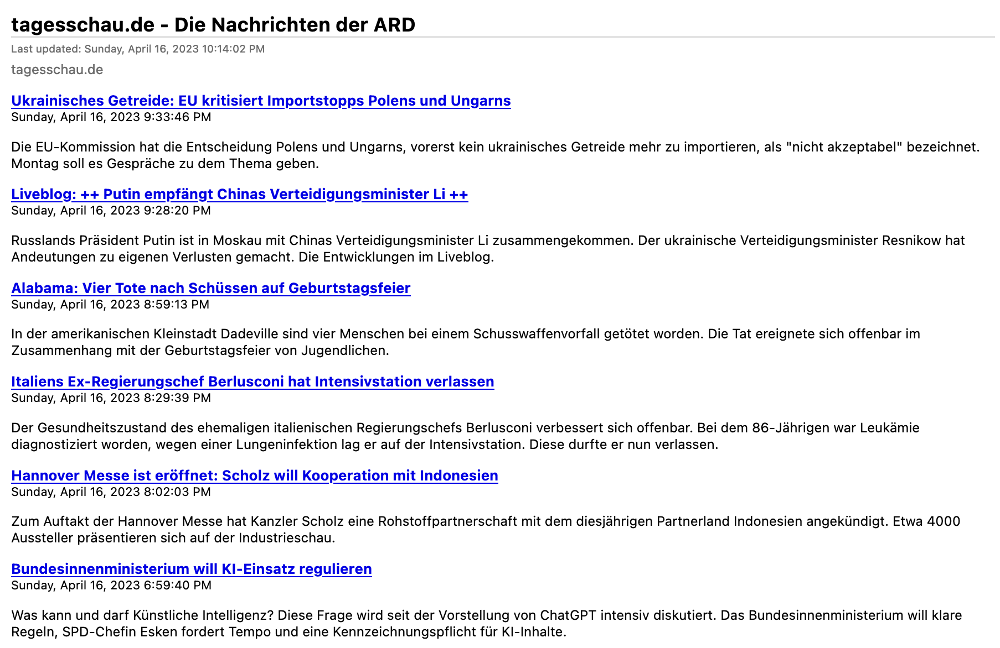
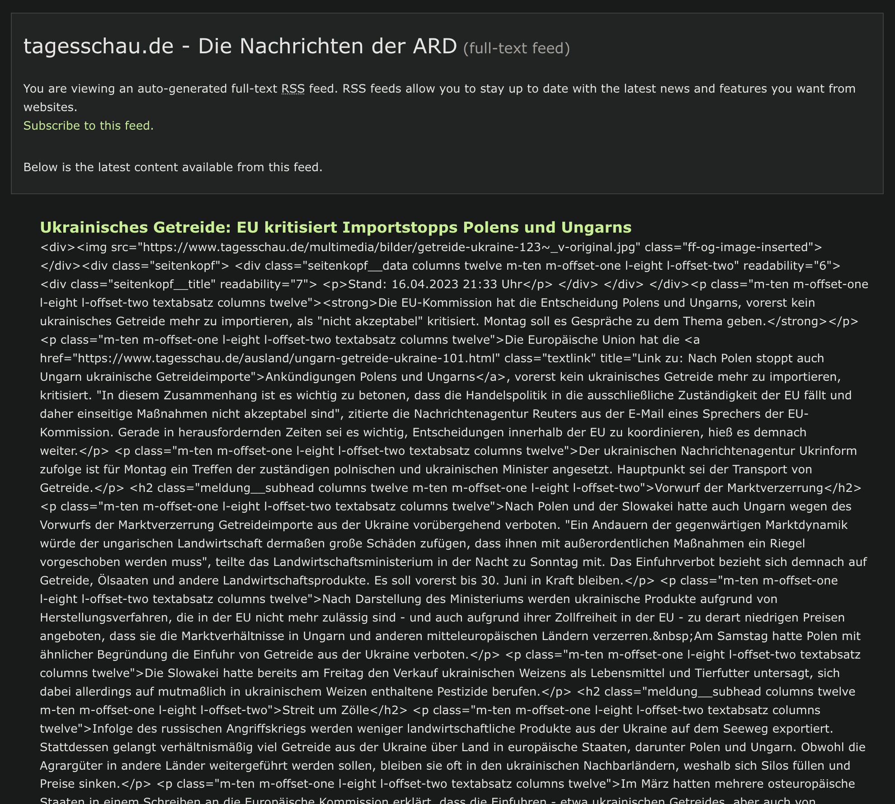
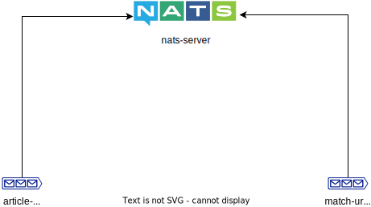
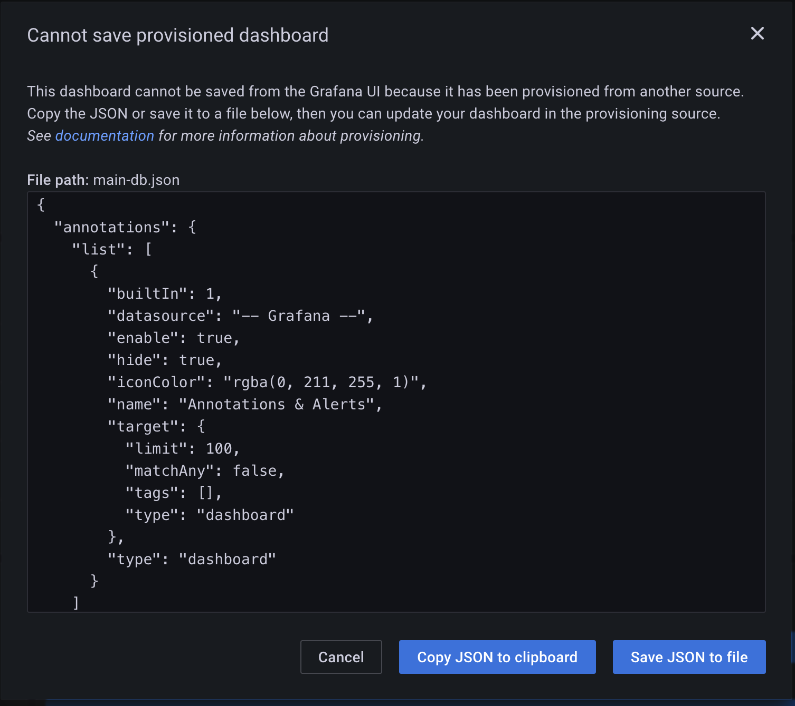
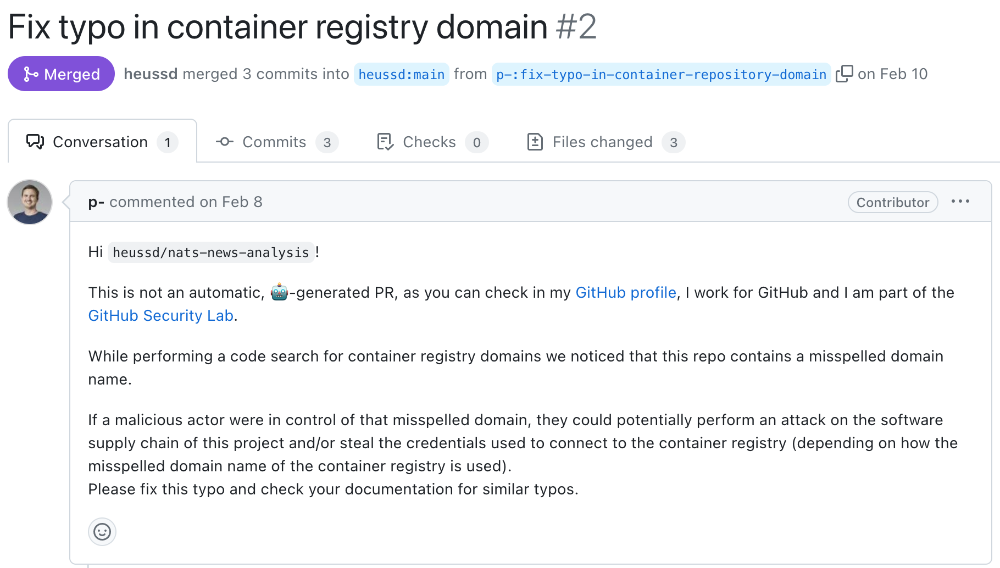
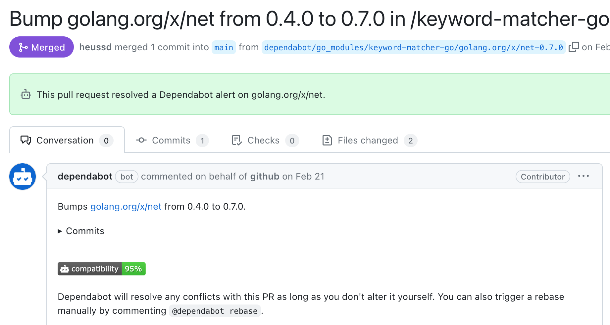
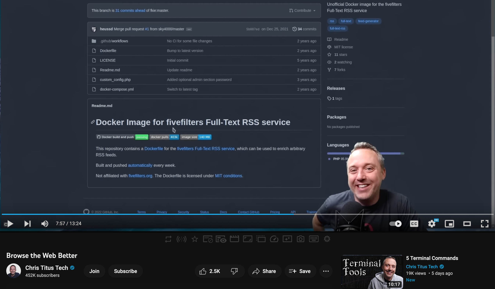
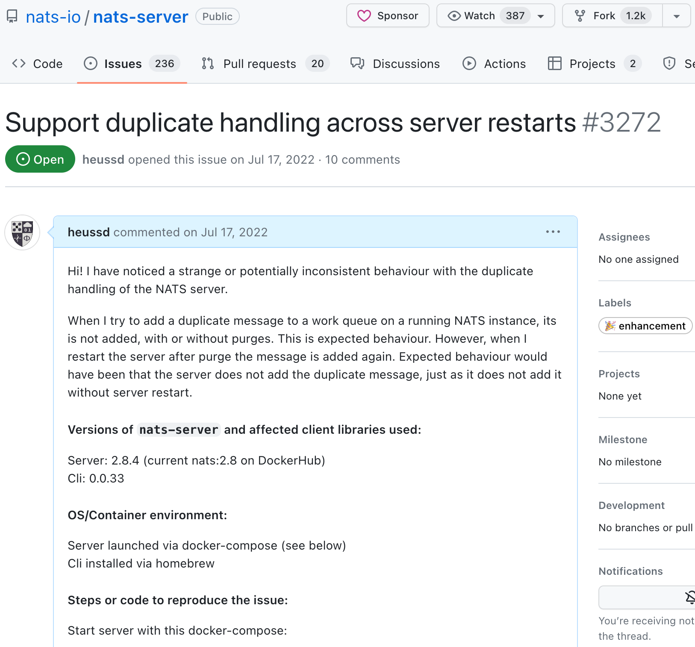

# Polyglot, scalable, observable news analysis

Timm Heuss

April 2023

---

<!-- .slide: data-background="https://i.stack.imgur.com/wVfnh.jpg" -->

<!-- section -->

This low-key session will be about a custom news crawling and analysis solution I've been building and improving for years now. The talk will cover the challenges I faced and how I evolved the architecture over time to eventually end up with a scalable, polyglot, observable system. We will also reflect about the beauty of open source on GitHub and message queues. In the hands-on session, we will scale the application interactively and monitor the performance in real-time.

Tech-Keywords: Docker, NATS.io, Prometheus, Loki, Grafana, Golang, Python

<!-- section -->

## Motivation & Idea

---

1. Staying up to date is key.
1. But there's too much information out there.
1. Also, don't trust centralised approaches.

---

Why not let _my machine_

find _relevant information for me_?

---

### RSS

Rich Site Summary

---

#### How many RSS feeds are delivered today



---

#### How they look like with fivefilters



---

### News Analysis in a nutshell

Have lists of RSS feeds.

Enrich them with fivefilters.

Match regexp against article full texts.

<!-- section -->

## Basic components

- NATS queue
- Article URL Feeder
- Keyword Matcher
- Pocket Integration
- Fivefilters

---

### It's all about URLs!



**article_urls**: URLs of articles from the internet

**match_urls**: URLs that match my interests

---

### Article URL Feeder


~50 feeds from manually curated sources

~630 feeds from [kilimchoi/engineering-blogs](https://github.com/kilimchoi/engineering-blogs)

---

### Keyword Matcher


Retrieves articles, matches against predefined regexes, puts successful matches on **match_urls** queue

---

#### keywords.txt

```text
# Simple name-dropping
Strange Loop

# Positive lookaheads
(?i)^(?=.*(docker))(?=.*(alternative|anti pattern|best practice|goodbye|ranger|podman|cli|benchmark)).*
```

---


---

### Pocket Integration


---

### Fivefilters


---

#### Matching centerpiece

```go
queue.WithArticleUrls(func(m *nats.Msg) {
    var url = string(m.Data)

    var fulltext = fulltextrss.RetrieveFullText(url)

    var text = prepareAndCleanString(fulltext)

    var match, regexId = keywords.Match(text)

    if match {
      queue.PushToPocket(model.Match{
        Url:     url,
        RegexId: regexId,
      })
    }
```

<https://github.com/heussd/nats-news-analysis/tree/main/keyword-matcher-go>

<!-- section -->


<!-- section -->

## Polyglotness


---

| Project | Client languages |
| :-----: | :--------------: |
|  NATS   |        29        |
|  Kafka  |        18        |
| Pulsar  |        7         |
| Rabbit  |        10        |

<https://docs.nats.io/nats-concepts/overview/compare-nats>

---

#### First implementation with Python


---

#### Re-implementations with Go


---

#### Why not both?


---

### Python vs. Go

| Metric             | Python  | Golang  | Comparison                |
| ------------------ | ------- | ------- | ------------------------- |
| Docker image size  | 424MB   | 6.09MB  | Go is ~70x smaller        |
| Memory consumption | 23,8MiB | 8,33MiB | Go needs ~3x less memory  |
| LoC                | 447     | 485     | Python has ~8% less lines |

---

### Python vs. Go execution performance?

Its complicated.

<!-- section -->

## Scalability


---

### Bottleneck: Keyword Matcher


---

### So lets scale it with docker compose

```yaml
keyword-matcher-go:
  scale: 4
  image: ghcr.io/heussd/nats-news-analysis/keyword-matcher-go:latest
```

---


---


---

### Parallel feeders

```yaml
  rss-article-url-feeder-go-1st:
    image: ghcr.io/heussd/nats-news-analysis/rss-article-url-feeder-go:latest
    [...]
    volumes:
      - type: bind
        source: ./urls-primary.txt
        target: /urls.txt
        consistency: cached
        read_only: true
  rss-article-url-feeder-go-2nd:
    [...]
    image: ghcr.io/heussd/nats-news-analysis/rss-article-url-feeder-go:latest
    volumes:
      - type: bind
        source: ./urls-secondary.txt
        target: /urls.txt
        consistency: cached
        read_only: true

```

---


---


---

### Bottleneck: Fivefilters


---

### Simple nginx load balancer

```config

events { worker_connections 1024; }

http {
 upstream fullfeedrss {
    server nats-news-analysis_fullfeedrss_1:80;
    server nats-news-analysis_fullfeedrss_2:80;
 }
 server {
    listen 80;
    location / {
       proxy_pass http://fullfeedrss;
    }
  }
}

```

---


---


<!-- section -->

## Observability


---

### Loki

- Push principle
- One or more containers push their logs to Loki
- [Docker driver](https://grafana.com/docs/loki/latest/clients/docker-driver/)

---

#### Setup loki in docker-compose

```yaml
services:
  service:
  	[...]
    logging:
      driver: loki
      options:
        loki-url: "http://host.docker.internal:3100/loki/api/v1/push"
```

---


---


---

### Prometheus

- Pull principle
- One container exposes an metrics endpoint
- Additional tooling exports metrics to Prom instance

---


---


---


<!-- section -->


<!-- section -->

## 🙌 Hands on 🙌

<!-- section -->

## Reflections

---

### Beauty of Cloud-native

---

Cloud-native Principles

==

Supercharge your Possibilities

---

#### ~170 LoC Docker Compose

- [rss-article-url-feeder-go](https://ghcr.io/heussd/nats-news-analysis/rss-article-url-feeder-go)
- [keyword-matcher-go](https://ghcr.io/heussd/nats-news-analysis/keyword-matcher-go)
- [pocket-integration](https://ghcr.io/heussd/nats-news-analysis/pocket-integration)
- [fivefilters-full-text-rss](https://hub.docker.com/r/heussd/fivefilters-full-text-rss)
- [nats](https://hub.docker.com/_/nats)
- [NGINX](https://www.nginx.com/)
- [Prometheus NATS Exporter](https://github.com/nats-io/prometheus-nats-exporter)
- [Prometheus](https://prometheus.io/)
- [Grafana Loki](https://grafana.com/oss/loki/)
- [Grafana](https://grafana.com/grafana/)

---

#### Tiny design decision - huge impact

| Measure       | Effort | Win                                           |
| ------------- | ------ | --------------------------------------------- |
| NATS          | medium | Use 29 languages, de-duplication, persistence |
| + Docker      | low    | Scale                                         |
| + nginx       | low    | Scale even better                             |
| + Loki Driver | low    | Mighty observability stack                    |
| + Grafana     | low    | Dashboard                                     |

---

#### "Throw-away mode" in Grafana



---

### Beauty of Open Source (at GitHub)

---

#### GitHub employees have your back ❤️



---

#### GitHub bots have your back ❤️



---

#### The community is talking code ❤️



---

#### The community is talking code ❤️



<!-- section -->

## Thank you

CNCF, GitHub, Docker, NATS FTW

<https://github.com/heussd/nats-news-analysis>
<https://github.com/heussd/talk-polyglot-scalable-observable-news-analysis>
